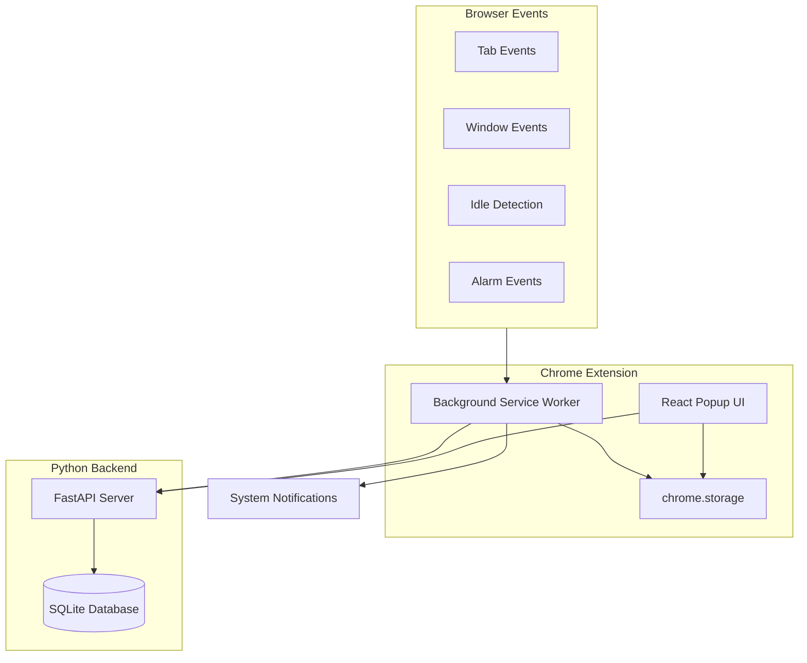
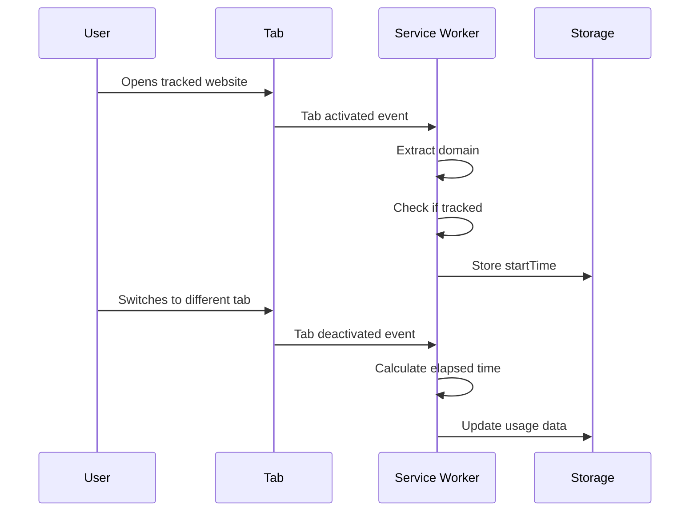
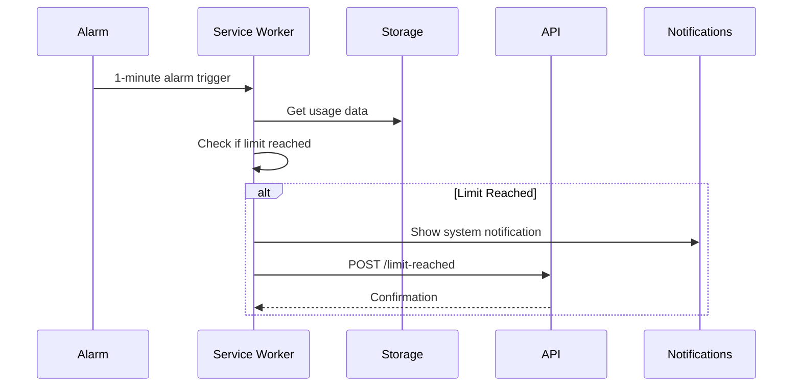
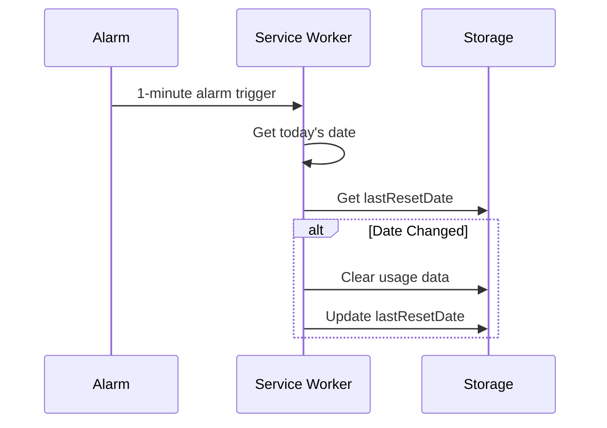
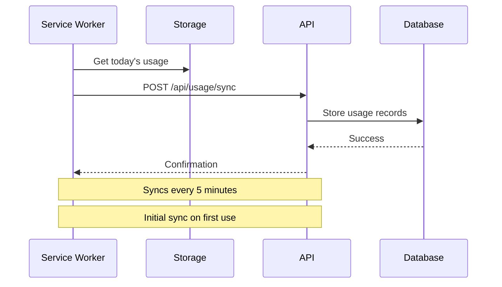
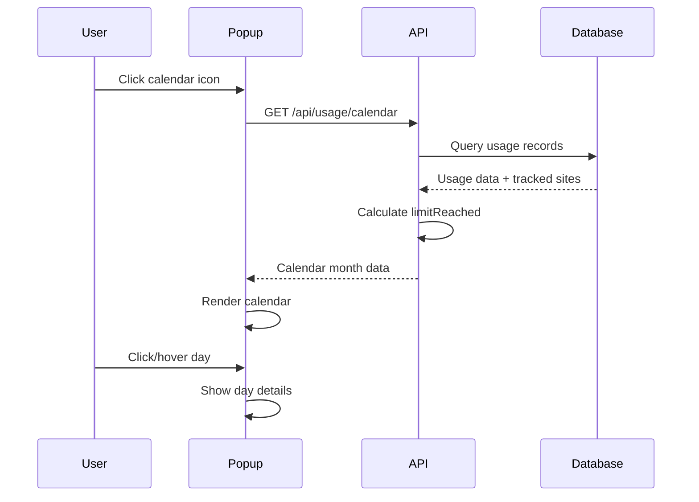

# Website Time Tracker Chrome Extension

A Chrome Extension (Manifest V3) that tracks time spent on user-defined websites, sends notifications when daily time limits are reached, and provides a historical calendar view of your usage patterns. Features automatic backend synchronization with SQLite database for persistent historical data.

## Table of Contents

- [Quick Start](#quick-start)
- [Project Overview](#project-overview)
- [Architecture & Design](#architecture--design)
- [Setup Instructions](#setup-instructions)
- [Usage Guide](#usage-guide)
- [Development Setup](#development-setup)
- [Testing](#testing)
- [Backend Setup](#backend-setup)
- [Troubleshooting](#troubleshooting)

## Quick Start

### Complete Setup (First Time)

1. **Install Prerequisites** (see [Setup Instructions](#setup-instructions) for details):
   - Node.js 20+ and npm
   - Python 3.10+ and uv

2. **Setup Extension**:
   ```bash
   cd extension
   npm install
   npm run build
   npm run icons:convert  # Generate PNG icons
   ```

3. **Setup Backend**:
   ```bash
   cd backend
   ./setup.sh              # Install dependencies
   ./migrate.sh            # ⚠️ Create database (destructive!)
   ```

4. **Start Backend Server**:
   ```bash
   cd backend
   ./run.sh                # Server runs on http://localhost:8000
   ```

5. **Load Extension in Chrome**:
   - Open `chrome://extensions/`
   - Enable "Developer mode"
   - Click "Load unpacked"
   - Select `extension/dist` directory

6. **Start Using**:
   - Click extension icon
   - Add tracked domains
   - Click calendar icon to view historical usage

### Resetting Database

If you need to reset the database (destroys all data):

```bash
cd backend
./migrate.sh  # Will prompt for confirmation
```

## Project Overview

### What It Does

The Website Time Tracker extension monitors the time you spend on specific websites. It only tracks time when:
- The tab is active
- The browser window is focused
- You are not idle (away from your computer)

When you reach a daily time limit for a tracked website, the extension:
- Shows a system notification
- Sends a notification to a Python API endpoint
- Allows you to continue using the site (non-blocking)

### Key Features

- **Selective Tracking**: Only track specific domains you add
- **Precise Time Tracking**: Only counts active, focused, non-idle time
- **Daily Limits**: Set individual time limits per website
- **Daily Reset**: Usage resets automatically at midnight (local time)
- **Real-time Dashboard**: View current usage in the extension popup
- **Historical Calendar View**: See your usage history with a month-by-month calendar
- **Backend Sync**: Automatic synchronization of usage data to backend database
- **API Integration**: Notify external systems when limits are reached

### Use Cases

- Monitor and limit time spent on social media
- Track productivity website usage
- Set boundaries for entertainment sites
- Collect usage data for analysis

## Architecture & Design

### System Architecture



### Component Descriptions

#### Background Service Worker (`background.ts`)

The "brain" of the extension. Handles all time tracking logic:

- **Event Listeners**: Responds to tab changes, window focus, and idle state
- **Time Calculation**: Uses timestamp deltas (not intervals) for accuracy
- **State Management**: Persists state to storage (service workers are ephemeral)
- **Limit Detection**: Checks limits every minute via alarms
- **API Communication**: Sends notifications to Python backend

#### React Popup UI (`popup/App.tsx`)

User interface for managing tracked sites:

- **Domain Management**: Add/remove tracked domains with limits (expandable panel)
- **Live Dashboard**: Real-time usage display with progress bars
- **Calendar View**: Historical usage calendar with month navigation (expandable panel)
- **Day Details**: Click any day to see detailed usage breakdown
- **Storage Sync**: Automatically updates when background script changes data
- **Backend Sync**: Fetches historical data from backend for calendar view

#### Utility Functions (`utils.ts`)

Helper functions for common operations:

- `extractDomain()`: Extract domain from URLs (subdomain-agnostic)
- `isDomainTracked()`: Check if a domain matches tracked sites
- `getTodayDate()`: Get current date in local timezone
- `updateUsage()`: Update usage data in storage

#### Background Sync (`utils/sync.ts`)

Automatic synchronization to backend:

- **Periodic Sync**: Syncs usage data every 5 minutes
- **Initial Sync**: On first use, syncs all historical data from local storage
- **Tracked Sites Sync**: Syncs domain limits to backend
- **Error Handling**: Queues failed syncs for retry

### Data Flow

#### Time Tracking Flow



#### Limit Detection Flow



#### Daily Reset Flow



#### Backend Sync Flow



#### Calendar Data Flow



### Storage Schema

#### chrome.storage.local (Persistent)

```typescript
{
  userId: "uuid-string",    // User ID for backend sync (auto-generated)
  trackedSites: {
    "youtube.com": 60,      // domain -> daily limit (minutes)
    "reddit.com": 30
  },
  usage: {
    "2023-10-27": {         // date -> daily usage
      "youtube.com": 45,    // domain -> minutes used
      "reddit.com": 15
    }
  },
  lastResetDate: "2023-10-27",  // Last reset date
  hasSyncedInitialData: true    // Flag indicating initial sync completed
}
```

#### chrome.storage.session (Runtime)

```typescript
{
  currentDomain: "youtube.com",  // Currently tracked domain
  startTime: 1698412800000,      // Timestamp when tracking started
  lastActiveTime: 1698412800000  // Last known active timestamp
}
```

### Service Worker Lifecycle

Service workers in Manifest V3 are **ephemeral** - they can be terminated at any time. The extension handles this by:

1. **State Restoration**: On wake-up, reads all state from storage
2. **No Global Variables**: All state is stored in chrome.storage
3. **Event-Driven**: Responds to events rather than maintaining continuous state

### Event Flow

- **Tab Events**: `chrome.tabs.onActivated`, `chrome.tabs.onUpdated`
- **Window Events**: `chrome.windows.onFocusChanged`
- **Idle Events**: `chrome.idle.onStateChanged` (60-second detection interval)
- **Alarm Events**: `chrome.alarms.onAlarm` (1-minute periodic checks, 5-minute sync checks)

## Setup Instructions

### Prerequisites

- **Node.js** 20+ and npm 10+
- **Python** 3.10+ (3.14 recommended, for backend)
- **uv** - Python package manager (for backend)
- **Chrome Browser** (for testing)

#### Installing/Upgrading Node.js and Python

**For detailed setup instructions, see [SETUP_GUIDE.md](SETUP_GUIDE.md)**

**Quick Reference:**

**Node.js:**
- Check current version: `node --version`
- If `nvm` is not installed, see [SETUP_GUIDE.md](SETUP_GUIDE.md) for installation instructions
- Once nvm is installed:
  ```bash
  nvm install --lts
  nvm use --lts
  nvm alias default lts/*
  ```
- Or use Homebrew: `brew install node`

**Python:**
- Install uv: `curl -LsSf https://astral.sh/uv/install.sh | sh`
- Install Python 3.14: `uv python install 3.14`
- See [SETUP_GUIDE.md](SETUP_GUIDE.md) for detailed instructions

### Installation

1. **Clone or download this repository**

2. **Install extension dependencies**:
   ```bash
   cd extension
   npm install
   ```

3. **Build the extension**:
   ```bash
   npm run build
   ```

4. **Generate icons** (if not already present):
   ```bash
   # Option 1: Convert SVG to PNG (Recommended - uses sharp)
   npm run icons:convert
   
   # Option 2: Using Python (requires Pillow)
   pip install Pillow
   python3 scripts/generate-icons.py
   
   # Option 3: Create icons manually (16x16, 48x48, 128x128 PNG files)
   # Place them in extension/public/icons/
   ```
   
   **Note:** Chrome extensions require PNG format for icons. SVG files are not supported in the manifest. The extension includes SVG source files that can be converted to PNG using the `icons:convert` script.

5. **Load extension in Chrome**:
   - Open Chrome and navigate to `chrome://extensions/`
   - Enable "Developer mode" (toggle in top-right)
   - Click "Load unpacked"
   - Select the `extension/dist` directory

6. **Set up Python backend** (see [Backend Setup](#backend-setup))
   - **IMPORTANT**: Run database migration before starting the server (see [Backend Setup](#backend-setup))

## Usage Guide

### Adding a Tracked Domain

1. Click the extension icon in Chrome toolbar
2. Enter a domain name (e.g., `youtube.com`) - no `https://` or `www.` needed
3. Enter a daily limit in minutes
4. Click "Add Domain"

### Viewing Usage

The popup shows:
- **Metrics Tile**: Total time today, total time allowed, and percentage used
- **List of Tracked Sites**: Current usage for today with progress bars
- **Red highlighting** when limit is reached

### Calendar View

View your historical usage with the calendar feature:

1. **Open Calendar**: Click the calendar icon (📅) next to the settings icon in the popup header
2. **Navigate Months**: Use the arrow buttons to move between months
3. **Day Indicators**:
   - **Green**: No limits were reached that day
   - **Red**: At least one domain exceeded its limit that day
4. **View Day Details**: Click or hover over any day to see:
   - Total time used that day
   - Total time allowed
   - Breakdown by domain with usage vs. limit
   - Which domains reached their limits

### Removing a Domain

Click the "Remove" button next to any tracked domain.

### Understanding Notifications

When a time limit is reached:
- A system notification appears (top-right on macOS)
- The extension sends data to the Python API
- You can continue using the site (it's not blocked)

### Daily Reset

Usage data automatically resets at **midnight local time**. The extension checks every minute and resets when the date changes.

### Backend Synchronization

The extension automatically syncs data to the backend:

- **User ID**: On first use, the extension generates a unique UUID and stores it locally. This ID is used for all backend API calls.
- **Initial Sync**: On first use, all historical usage data from local storage is synced to the backend
- **Periodic Sync**: Usage data is synced every 5 minutes
- **Tracked Sites Sync**: Domain limits are synced whenever they change
- **Error Handling**: Failed syncs are logged but don't block the extension

**Note**: The backend must be running for sync to work. If the backend is unavailable, the extension will continue to work locally, but calendar data won't be available.

## Development Setup

### Project Structure

```
extension/
├── src/
│   ├── background.ts       # Service worker with sync logic
│   ├── popup/              # React UI
│   │   ├── components/     # React components
│   │   │   ├── CalendarView.tsx
│   │   │   ├── CalendarPanel.tsx
│   │   │   ├── DayCell.tsx
│   │   │   └── DayDetailsExpansion.tsx
│   │   ├── hooks/          # React hooks
│   │   │   ├── useCalendar.ts
│   │   │   └── useUserId.ts
│   │   └── utils/          # Utilities
│   │       └── api.ts      # Backend API client
│   ├── utils/              # Shared utilities
│   │   └── sync.ts         # Background sync logic
│   ├── types.ts            # TypeScript interfaces
│   └── utils.ts            # Helper functions
├── __tests__/              # Unit tests
├── public/icons/           # Extension icons
├── manifest.json           # Extension manifest
└── vite.config.ts         # Build configuration
```

### Development Workflow

1. **Start development mode**:
   ```bash
   cd extension
   npm run dev
   ```
   This watches for changes and rebuilds automatically.

2. **Reload extension in Chrome**:
   - Go to `chrome://extensions/`
   - Click the reload icon on your extension

3. **Debug the service worker**:
   - Go to `chrome://extensions/`
   - Click "service worker" link under your extension
   - Opens DevTools for the background script

4. **Debug the popup**:
   - Right-click the extension icon
   - Select "Inspect popup"

### Hot Reload

The `@crxjs/vite-plugin` supports hot module replacement. Changes to the popup UI will reload automatically. For background script changes, you may need to reload the extension.

### Debugging Tips

- **Service Worker**: Check `chrome://serviceworker-internals/` to see worker status
- **Storage**: Use `chrome.storage.local.get(null, console.log)` in service worker console
- **Network**: Check Network tab in service worker DevTools for API calls
- **Errors**: Check both service worker console and popup console

### Chrome DevTools Usage

- **Service Worker Console**: Debug background script logic
- **Popup Console**: Debug React UI issues
- **Application Tab**: Inspect chrome.storage data
- **Network Tab**: Monitor API requests

## Testing

### Running Unit Tests

```bash
cd extension
npm test
```

### Running Tests with UI

```bash
npm run test:ui
```

### Generating Coverage Report

```bash
npm run test:coverage
```

### Test Structure

- **`__tests__/utils.test.ts`**: Tests for utility functions
- **`__tests__/background.test.ts`**: Tests for background service worker (mocked)
- **`__tests__/setup.ts`**: Test setup and chrome API mocks
- **`__tests__/popup/`**: Tests for React components and hooks
  - **`components/`**: Component tests (CalendarPanel, etc.)
  - **`hooks/`**: Hook tests (useCalendar, useUserId)
  - **`utils/`**: API utility tests

### Writing New Tests

1. Create test file in `__tests__/` directory
2. Import functions to test
3. Mock chrome APIs using setup from `setup.ts`
4. Write test cases using Vitest

Example:
```typescript
import { describe, it, expect } from 'vitest';
import { extractDomain } from '../src/utils';

describe('extractDomain', () => {
  it('should extract domain from URL', () => {
    expect(extractDomain('https://www.youtube.com')).toBe('youtube.com');
  });
});
```

### Mocking Chrome APIs

The test setup (`__tests__/setup.ts`) provides mocked chrome APIs. Use `resetMocks()` between tests to clear state.

## Backend Setup

### Prerequisites

Install uv:
```bash
curl -LsSf https://astral.sh/uv/install.sh | sh
# or: brew install uv
```

Install Python 3.10+ (if needed):
```bash
uv python install 3.14
```

### First Time Setup

1. **Install dependencies**:
   ```bash
   cd backend
   ./setup.sh
   ```

2. **⚠️ IMPORTANT: Initialize Database**:
   ```bash
   cd backend
   ./migrate.sh
   ```
   
   This will:
   - **Destroy any existing database** (you'll be prompted to confirm)
   - Create all tables (users, tracked_sites, usage_records)
   - Create indexes for performance
   - **If `ENVIRONMENT=dev` in `.env`**: Automatically seed test data for the past week
   
   **Note**: This is a **destructive operation**. All existing data will be lost. Only run this when you want to reset the database.

3. **Start the server**:
   ```bash
   ./run.sh
   ```

Server runs on `http://localhost:8000`

**Important**: The database is **NOT** automatically created on server startup. You must run `./migrate.sh` manually before starting the server for the first time.

### Resetting the Database

To reset the database (destroys all data):

```bash
cd backend
./migrate.sh
```

You'll be prompted to confirm before the database is destroyed. This will:
1. Drop all existing tables
2. Recreate all tables from models
3. Recreate all indexes

**Warning**: This operation is **irreversible**. All user data, tracked sites, and usage records will be permanently deleted.

### Development Mode & Test Data

The project includes a development mode feature that automatically seeds test data and uses a hardcoded user ID for easier testing and validation.

#### Backend Development Mode

1. **Create `.env` file** in the `backend/` directory:
   ```bash
   cd backend
   echo "ENVIRONMENT=dev" > .env
   ```

2. **Run migration** - The migration script will automatically:
   - Detect development mode from the `ENVIRONMENT=dev` variable
   - Create a test user with ID `"123"`
   - Seed fake data for the past 7 days with 3 tracked sites:
     - `youtube.com` (60 min limit)
     - `reddit.com` (30 min limit)
     - `twitter.com` (45 min limit)
   - Generate usage records with varied patterns (some over limit, some under, some at limit)

3. **Check logs** - When running `./migrate.sh` in dev mode, you'll see:
   ```
   🔧 DEVELOPMENT MODE DETECTED
      ENVIRONMENT variable: dev
      Using hardcoded user ID '123' to match extension
   ```

#### Extension Development Mode

The extension automatically detects development mode when the API base URL is `localhost:8000` or `127.0.0.1`:

- **Automatically uses user ID `"123"`** to match the seeded test data
- **Logs to console**: `[DEV MODE] Development environment detected - using hardcoded user ID "123"`
- In production (non-localhost URLs), it generates and stores random UUIDs

**Benefits:**
- Test data is immediately visible in the extension calendar view
- No need to manually sync or create test users
- Consistent user ID across backend and extension in development

**To verify development mode is working:**
1. Open Chrome DevTools (right-click extension icon → Inspect popup)
2. Check the console for the `[DEV MODE]` log message
3. The calendar should show the past week's seeded data

### Database Location

By default, the database is created at:
```
backend/website_tracker.db
```

To use a different location, set the `DATABASE_URL` environment variable:
```bash
export DATABASE_URL="sqlite:///./custom_path.db"
./migrate.sh
```

### Backend Architecture

The backend follows a **layered architecture** (Hexagonal Architecture):

```
backend/website_tracker_backend/
├── application/          # Application Layer (HTTP/API)
│   ├── routers/          # API endpoints, validation
│   ├── schemas.py        # Pydantic request/response models
│   └── dependencies.py   # Dependency injection
├── domain/               # Domain Layer (Business Logic)
│   ├── interfaces/       # Repository interfaces (ports)
│   └── services/         # Domain services (business logic)
└── infrastructure/       # Infrastructure Layer
    ├── database/         # Database models and connection
    └── adapters/         # Repository implementations
```

**Benefits:**
- Clear separation of concerns
- Business logic independent of database/HTTP
- Easy to test (mock repositories for domain tests)
- Easy to swap implementations (e.g., different database)

### API Endpoint Documentation

#### POST /limit-reached

Receives notifications when a website time limit is reached.

**Request Body:**
```json
{
  "domain": "youtube.com",
  "minutes": 60,
  "timestamp": "2023-10-27T12:00:00.000Z"
}
```

**Response:**
```json
{
  "status": "received",
  "domain": "youtube.com",
  "minutes": 60,
  "timestamp": "2023-10-27T12:00:00.000Z"
}
```

#### POST /api/usage/sync

Sync daily usage data from extension to backend.

**Headers:**
```
X-User-ID: <user-uuid>
```

**Request Body:**
```json
{
  "date": "2024-01-15",
  "usage": {
    "youtube.com": 45.5,
    "reddit.com": 30.0
  }
}
```

**Response:**
```json
{
  "status": "success",
  "synced": 2,
  "date": "2024-01-15"
}
```

#### GET /api/usage/calendar

Get calendar month data with usage information.

**Headers:**
```
X-User-ID: <user-uuid>
```

**Query Parameters:**
- `year`: Year (e.g., 2024)
- `month`: Month (1-12)

**Response:**
```json
{
  "year": 2024,
  "month": 1,
  "days": [
    {
      "date": "2024-01-15",
      "totalUsage": 75.5,
      "domainUsage": {
        "youtube.com": 45.5,
        "reddit.com": 30.0
      },
      "limitReached": false,
      "domains": [
        {
          "domain": "youtube.com",
          "minutes": 45.5,
          "limit": 60,
          "limitReached": false,
          "percentage": 75.8
        }
      ]
    }
  ]
}
```

#### GET /api/usage/day

Get detailed usage information for a specific day.

**Headers:**
```
X-User-ID: <user-uuid>
```

**Query Parameters:**
- `date_str`: Date in YYYY-MM-DD format

**Response:**
```json
{
  "date": "2024-01-15",
  "totalUsage": 75.5,
  "totalLimit": 90,
  "domains": [
    {
      "domain": "youtube.com",
      "minutes": 45.5,
      "limit": 60,
      "limitReached": false,
      "percentage": 75.8
    }
  ],
  "metrics": {
    "totalMinutes": 75.5,
    "totalLimit": 90,
    "totalPercentage": 83.9,
    "domainsOverLimit": 0,
    "domainsTracked": 2
  }
}
```

#### POST /api/tracked-sites/sync

Sync tracked sites from extension to backend.

**Headers:**
```
X-User-ID: <user-uuid>
```

**Request Body:**
```json
{
  "trackedSites": {
    "youtube.com": 60,
    "reddit.com": 30
  }
}
```

**Response:**
```json
{
  "status": "success",
  "synced": 2
}
```

#### GET /api/tracked-sites

Get all tracked sites for a user.

**Headers:**
```
X-User-ID: <user-uuid>
```

**Response:**
```json
{
  "trackedSites": {
    "youtube.com": 60,
    "reddit.com": 30
  }
}
```

### CORS Configuration

The API is configured to accept requests from Chrome extensions. The current configuration allows all origins (`*`). In production, you may want to restrict this to specific extension IDs:

```python
allow_origins=["chrome-extension://your-extension-id"]
```

### Testing the API

You can test API endpoints using curl:

**Test limit-reached endpoint:**
```bash
curl -X POST http://localhost:8000/limit-reached \
  -H "Content-Type: application/json" \
  -d '{"domain": "youtube.com", "minutes": 60, "timestamp": "2023-10-27T12:00:00"}'
```

**Test usage sync (requires user ID):**
```bash
# First, get a user ID from the extension (stored in chrome.storage.local)
curl -X POST http://localhost:8000/api/usage/sync \
  -H "Content-Type: application/json" \
  -H "X-User-ID: <your-user-id>" \
  -d '{"date": "2024-01-15", "usage": {"youtube.com": 45.5}}'
```

**Test calendar endpoint:**
```bash
curl -X GET "http://localhost:8000/api/usage/calendar?year=2024&month=1" \
  -H "X-User-ID: <your-user-id>"
```

### Running Backend Tests

```bash
cd backend
uv run pytest __tests__/ -v
```

Test structure:
- **`__tests__/domain/`**: Domain service tests (with mocks)
- **`__tests__/infrastructure/`**: Repository implementation tests (with real DB)
- **`__tests__/test_*_router.py`**: API endpoint integration tests
- **`__tests__/test_database.py`**: Database model tests

## Troubleshooting

### Extension Not Loading

- **Check build output**: Ensure `npm run build` completed successfully
- **Check manifest.json**: Verify it's valid JSON
- **Check console**: Look for errors in `chrome://extensions/` page
- **Check permissions**: Ensure all required permissions are in manifest

### Notifications Not Appearing

- **Check macOS settings**: System Settings → Notifications → Chrome
- **Check Do Not Disturb**: Disable if enabled
- **Check extension permissions**: Ensure "notifications" permission is granted
- **Check service worker**: Verify it's running in `chrome://serviceworker-internals/`

### Time Not Tracking

- **Check if domain is tracked**: Open popup and verify domain is in list
- **Check tab is active**: Extension only tracks the active tab
- **Check window focus**: Extension pauses when window loses focus
- **Check idle state**: Extension stops tracking when idle
- **Check service worker**: Ensure it's running and not errored

### API Connection Issues

- **Check backend is running**: Verify server is running on port 8000
- **Check database is initialized**: Run `./migrate.sh` if you haven't already
- **Check CORS**: Verify backend allows extension origin
- **Check network**: Verify localhost:8000 is accessible
- **Check console**: Look for fetch errors in service worker console
- **Check retry logic**: Failed requests are retried 3 times with exponential backoff
- **Check user ID**: Extension automatically generates and stores a user ID on first use

### Calendar Not Loading

- **Check backend is running**: Calendar requires backend to be running on `http://localhost:8000`
- **Check database is initialized**: Run `./migrate.sh` if you haven't already
- **Check network connection**: Calendar fetches data from backend API
- **Check browser console**: Look for API errors in popup DevTools (right-click extension icon → Inspect popup)
- **Check backend logs**: Verify API requests are being received (check server console)
- **Check user ID**: Extension generates user ID on first use. Check `chrome.storage.local` if needed
- **Try refreshing**: Calendar data is cached in sessionStorage, but may need refresh
- **Check CORS**: Backend should allow all origins (default configuration)

### Finding Your User ID

To find your user ID for testing API endpoints:

1. **In Extension**:
   - Open popup DevTools (right-click extension icon → Inspect popup)
   - Run in console: `chrome.storage.local.get('userId', console.log)`

2. **In Service Worker**:
   - Open service worker DevTools (`chrome://extensions/` → click "service worker")
   - Run in console: `chrome.storage.local.get('userId', console.log)`

### Daily Reset Not Working

- **Check timezone**: Reset happens at midnight **local time**
- **Check lastResetDate**: Verify it's updating in storage
- **Check alarm**: Ensure alarm is firing (check service worker console)
- **Manual reset**: You can manually clear usage data in storage

### Storage Issues

- **Clear storage**: Use `chrome.storage.local.clear()` in service worker console
- **Check quota**: Chrome storage has a 10MB limit
- **Inspect storage**: Use Application tab in DevTools to view storage data

### Build Errors

- **TypeScript errors**: Run `npm run build` to see detailed errors
- **Missing dependencies**: Run `npm install` again
- **Vite errors**: Check `vite.config.ts` for configuration issues
- **Missing icon files**: If build fails with "Could not load manifest asset", ensure PNG icons exist:
  ```bash
  npm run icons:convert
  ```

### Service Worker Not Starting

- **Check manifest**: Verify service worker path is correct
- **Check errors**: Look in `chrome://serviceworker-internals/`
- **Reload extension**: Sometimes a reload fixes worker issues
- **Check imports**: Ensure all imports are valid

### Database Issues

- **Database not found**: Run `./migrate.sh` to create the database
- **Tables missing**: Run `./migrate.sh` to create all tables
- **Migration fails**: Check that SQLite is available and the database file path is writable
- **Reset database**: Run `./migrate.sh` (destroys all data)
- **Database location**: Default is `./website_tracker.db` in the backend directory
- **Change database location**: Set `DATABASE_URL` environment variable before running `./migrate.sh`

## License

This project is provided as-is for educational and personal use.

