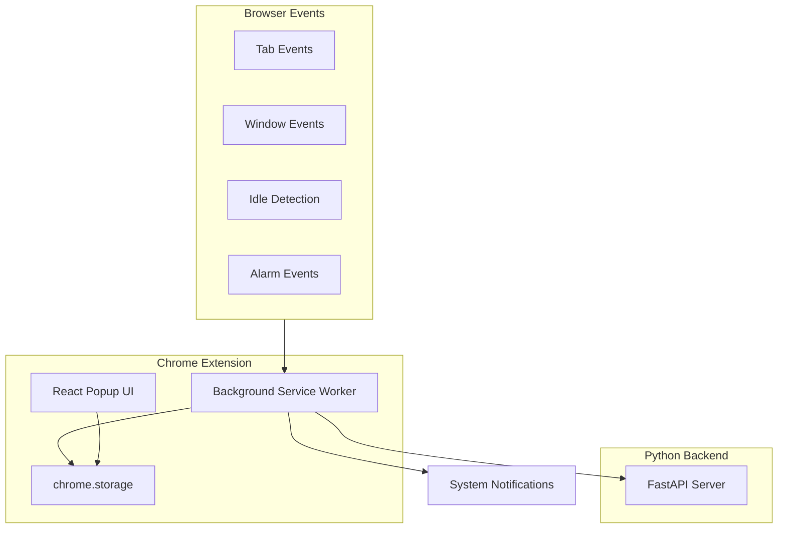
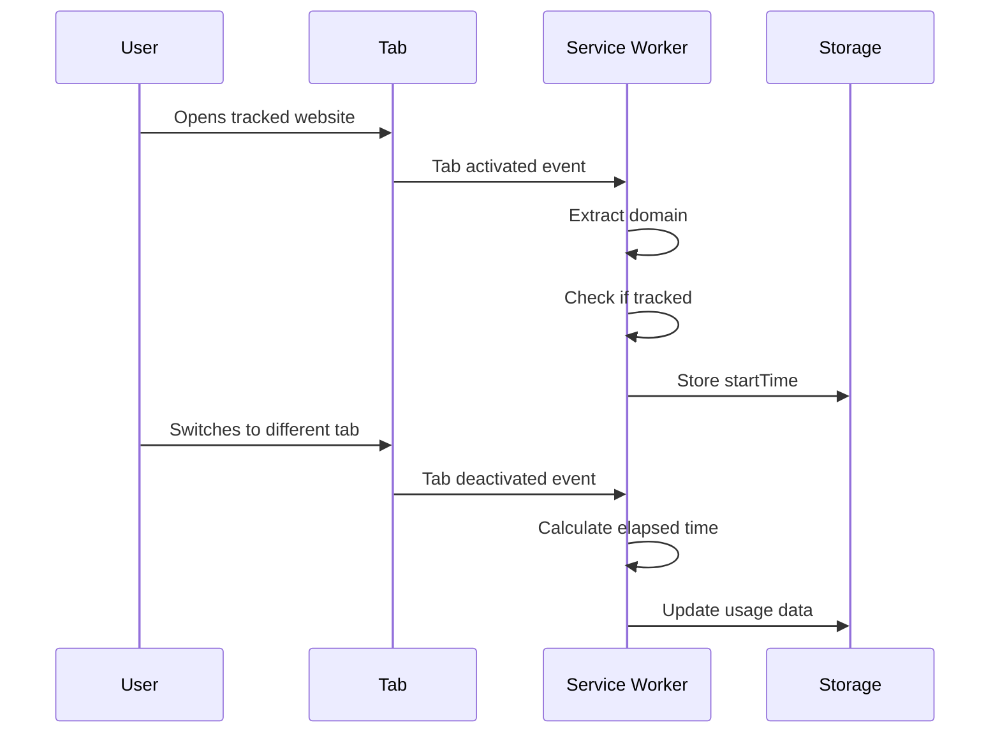
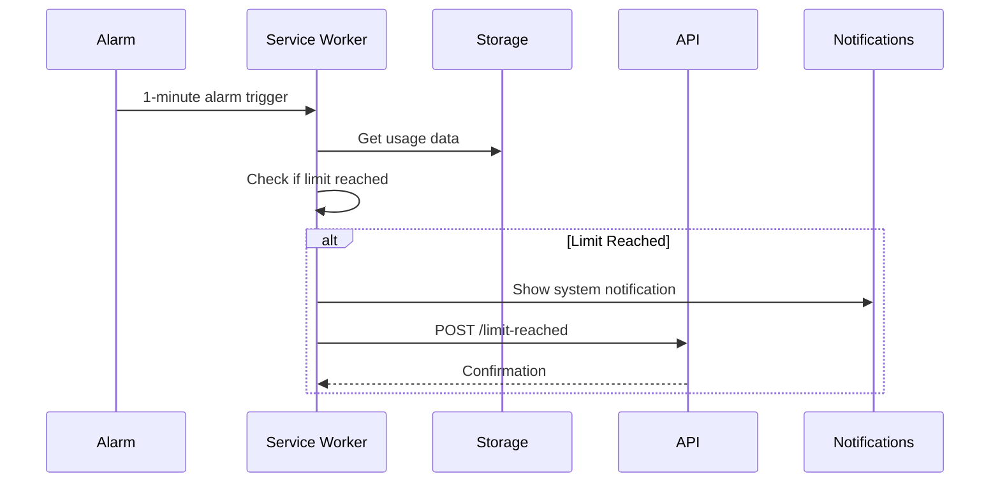
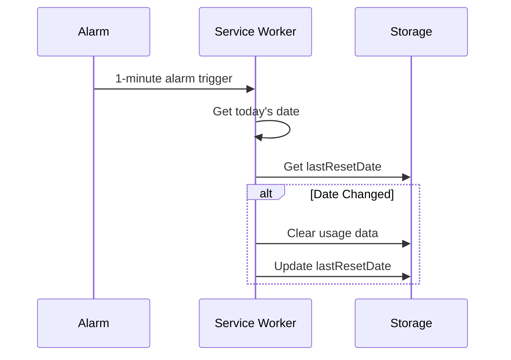

# Website Time Tracker Chrome Extension

A Chrome Extension (Manifest V3) that tracks time spent on user-defined websites and sends notifications when daily time limits are reached.

## Table of Contents

- [Project Overview](#project-overview)
- [Architecture & Design](#architecture--design)
- [Setup Instructions](#setup-instructions)
- [Usage Guide](#usage-guide)
- [Development Setup](#development-setup)
- [Testing](#testing)
- [Backend Setup](#backend-setup)
- [Troubleshooting](#troubleshooting)

## Project Overview

### What It Does

The Website Time Tracker extension monitors the time you spend on specific websites. It only tracks time when:
- The tab is active
- The browser window is focused
- You are not idle (away from your computer)

When you reach a daily time limit for a tracked website, the extension:
- Shows a system notification
- Sends a notification to a Python API endpoint
- Allows you to continue using the site (non-blocking)

### Key Features

- **Selective Tracking**: Only track specific domains you add
- **Precise Time Tracking**: Only counts active, focused, non-idle time
- **Daily Limits**: Set individual time limits per website
- **Daily Reset**: Usage resets automatically at midnight (local time)
- **Real-time Dashboard**: View current usage in the extension popup
- **API Integration**: Notify external systems when limits are reached

### Use Cases

- Monitor and limit time spent on social media
- Track productivity website usage
- Set boundaries for entertainment sites
- Collect usage data for analysis

## Architecture & Design

### System Architecture



### Component Descriptions

#### Background Service Worker (`background.ts`)

The "brain" of the extension. Handles all time tracking logic:

- **Event Listeners**: Responds to tab changes, window focus, and idle state
- **Time Calculation**: Uses timestamp deltas (not intervals) for accuracy
- **State Management**: Persists state to storage (service workers are ephemeral)
- **Limit Detection**: Checks limits every minute via alarms
- **API Communication**: Sends notifications to Python backend

#### React Popup UI (`popup/App.tsx`)

User interface for managing tracked sites:

- **Domain Management**: Add/remove tracked domains with limits
- **Live Dashboard**: Real-time usage display with progress bars
- **Storage Sync**: Automatically updates when background script changes data

#### Utility Functions (`utils.ts`)

Helper functions for common operations:

- `extractDomain()`: Extract domain from URLs (subdomain-agnostic)
- `isDomainTracked()`: Check if a domain matches tracked sites
- `getTodayDate()`: Get current date in local timezone
- `updateUsage()`: Update usage data in storage

### Data Flow

#### Time Tracking Flow



#### Limit Detection Flow



#### Daily Reset Flow



### Storage Schema

#### chrome.storage.local (Persistent)

```typescript
{
  trackedSites: {
    "youtube.com": 60,      // domain -> daily limit (minutes)
    "reddit.com": 30
  },
  usage: {
    "2023-10-27": {         // date -> daily usage
      "youtube.com": 45,    // domain -> minutes used
      "reddit.com": 15
    }
  },
  lastResetDate: "2023-10-27"  // Last reset date
}
```

#### chrome.storage.session (Runtime)

```typescript
{
  currentDomain: "youtube.com",  // Currently tracked domain
  startTime: 1698412800000,      // Timestamp when tracking started
  lastActiveTime: 1698412800000  // Last known active timestamp
}
```

### Service Worker Lifecycle

Service workers in Manifest V3 are **ephemeral** - they can be terminated at any time. The extension handles this by:

1. **State Restoration**: On wake-up, reads all state from storage
2. **No Global Variables**: All state is stored in chrome.storage
3. **Event-Driven**: Responds to events rather than maintaining continuous state

### Event Flow

- **Tab Events**: `chrome.tabs.onActivated`, `chrome.tabs.onUpdated`
- **Window Events**: `chrome.windows.onFocusChanged`
- **Idle Events**: `chrome.idle.onStateChanged` (60-second detection interval)
- **Alarm Events**: `chrome.alarms.onAlarm` (1-minute periodic checks)

## Setup Instructions

### Prerequisites

- **Node.js** 20+ (LTS recommended) and npm 10+
- **Python** 3.11+ (3.12 recommended) (for backend)
- **Chrome Browser** (for testing)

#### Upgrading Node.js and Python

**Node.js:**
- Check current version: `node --version`
- Recommended: Use [nvm](https://github.com/nvm-sh/nvm) to manage Node.js versions
  ```bash
  nvm install --lts
  nvm use --lts
  ```
- Or use Homebrew: `brew upgrade node`

**Python:**
- Check current version: `python3 --version`
- Recommended: Use [pyenv](https://github.com/pyenv/pyenv) to manage Python versions
  ```bash
  pyenv install 3.12
  pyenv global 3.12
  ```
- Or use Homebrew: `brew upgrade python`

### Installation

1. **Clone or download this repository**

2. **Install extension dependencies**:
   ```bash
   cd extension
   npm install
   ```

3. **Build the extension**:
   ```bash
   npm run build
   ```

4. **Generate icons** (if not already present):
   ```bash
   # Option 1: Using Python (requires Pillow)
   pip install Pillow
   python3 scripts/generate-icons.py
   
   # Option 2: Create icons manually (16x16, 48x48, 128x128 PNG files)
   # Place them in extension/public/icons/
   ```

5. **Load extension in Chrome**:
   - Open Chrome and navigate to `chrome://extensions/`
   - Enable "Developer mode" (toggle in top-right)
   - Click "Load unpacked"
   - Select the `extension/dist` directory

6. **Set up Python backend** (see [Backend Setup](#backend-setup))

## Usage Guide

### Adding a Tracked Domain

1. Click the extension icon in Chrome toolbar
2. Enter a domain name (e.g., `youtube.com`) - no `https://` or `www.` needed
3. Enter a daily limit in minutes
4. Click "Add Domain"

### Viewing Usage

The popup shows:
- List of all tracked domains
- Current usage for today (in minutes)
- Progress bar showing usage vs. limit
- Red highlighting when limit is reached

### Removing a Domain

Click the "Remove" button next to any tracked domain.

### Understanding Notifications

When a time limit is reached:
- A system notification appears (top-right on macOS)
- The extension sends data to the Python API
- You can continue using the site (it's not blocked)

### Daily Reset

Usage data automatically resets at **midnight local time**. The extension checks every minute and resets when the date changes.

## Development Setup

### Project Structure

```
extension/
├── src/
│   ├── background.ts       # Service worker
│   ├── popup/              # React UI
│   ├── types.ts            # TypeScript interfaces
│   └── utils.ts            # Helper functions
├── __tests__/              # Unit tests
├── public/icons/           # Extension icons
├── manifest.json           # Extension manifest
└── vite.config.ts         # Build configuration
```

### Development Workflow

1. **Start development mode**:
   ```bash
   cd extension
   npm run dev
   ```
   This watches for changes and rebuilds automatically.

2. **Reload extension in Chrome**:
   - Go to `chrome://extensions/`
   - Click the reload icon on your extension

3. **Debug the service worker**:
   - Go to `chrome://extensions/`
   - Click "service worker" link under your extension
   - Opens DevTools for the background script

4. **Debug the popup**:
   - Right-click the extension icon
   - Select "Inspect popup"

### Hot Reload

The `@crxjs/vite-plugin` supports hot module replacement. Changes to the popup UI will reload automatically. For background script changes, you may need to reload the extension.

### Debugging Tips

- **Service Worker**: Check `chrome://serviceworker-internals/` to see worker status
- **Storage**: Use `chrome.storage.local.get(null, console.log)` in service worker console
- **Network**: Check Network tab in service worker DevTools for API calls
- **Errors**: Check both service worker console and popup console

### Chrome DevTools Usage

- **Service Worker Console**: Debug background script logic
- **Popup Console**: Debug React UI issues
- **Application Tab**: Inspect chrome.storage data
- **Network Tab**: Monitor API requests

## Testing

### Running Unit Tests

```bash
cd extension
npm test
```

### Running Tests with UI

```bash
npm run test:ui
```

### Generating Coverage Report

```bash
npm run test:coverage
```

### Test Structure

- **`__tests__/utils.test.ts`**: Tests for utility functions
- **`__tests__/background.test.ts`**: Tests for background service worker (mocked)
- **`__tests__/setup.ts`**: Test setup and chrome API mocks

### Writing New Tests

1. Create test file in `__tests__/` directory
2. Import functions to test
3. Mock chrome APIs using setup from `setup.ts`
4. Write test cases using Vitest

Example:
```typescript
import { describe, it, expect } from 'vitest';
import { extractDomain } from '../src/utils';

describe('extractDomain', () => {
  it('should extract domain from URL', () => {
    expect(extractDomain('https://www.youtube.com')).toBe('youtube.com');
  });
});
```

### Mocking Chrome APIs

The test setup (`__tests__/setup.ts`) provides mocked chrome APIs. Use `resetMocks()` between tests to clear state.

## Backend Setup

### Python Environment Setup

1. **Create virtual environment** (recommended):
   ```bash
   cd backend
   python3 -m venv venv
   source venv/bin/activate  # On Windows: venv\Scripts\activate
   ```

2. **Install dependencies**:
   ```bash
   pip install -r requirements.txt
   ```

### Running the Server

```bash
python main.py
```

Or using uvicorn directly:
```bash
uvicorn main:app --host 0.0.0.0 --port 8000 --reload
```

The server will start on `http://localhost:8000`

### API Endpoint Documentation

#### POST /limit-reached

Receives notifications when a website time limit is reached.

**Request Body:**
```json
{
  "domain": "youtube.com",
  "minutes": 60,
  "timestamp": "2023-10-27T12:00:00.000Z"
}
```

**Response:**
```json
{
  "status": "received",
  "domain": "youtube.com",
  "minutes": 60,
  "timestamp": "2023-10-27T12:00:00.000Z"
}
```

### CORS Configuration

The API is configured to accept requests from Chrome extensions. The current configuration allows all origins (`*`). In production, you may want to restrict this to specific extension IDs:

```python
allow_origins=["chrome-extension://your-extension-id"]
```

### Testing the API

You can test the API endpoint using curl:

```bash
curl -X POST http://localhost:8000/limit-reached \
  -H "Content-Type: application/json" \
  -d '{"domain": "youtube.com", "minutes": 60, "timestamp": "2023-10-27T12:00:00"}'
```

## Troubleshooting

### Extension Not Loading

- **Check build output**: Ensure `npm run build` completed successfully
- **Check manifest.json**: Verify it's valid JSON
- **Check console**: Look for errors in `chrome://extensions/` page
- **Check permissions**: Ensure all required permissions are in manifest

### Notifications Not Appearing

- **Check macOS settings**: System Settings → Notifications → Chrome
- **Check Do Not Disturb**: Disable if enabled
- **Check extension permissions**: Ensure "notifications" permission is granted
- **Check service worker**: Verify it's running in `chrome://serviceworker-internals/`

### Time Not Tracking

- **Check if domain is tracked**: Open popup and verify domain is in list
- **Check tab is active**: Extension only tracks the active tab
- **Check window focus**: Extension pauses when window loses focus
- **Check idle state**: Extension stops tracking when idle
- **Check service worker**: Ensure it's running and not errored

### API Connection Issues

- **Check backend is running**: Verify server is running on port 8000
- **Check CORS**: Verify backend allows extension origin
- **Check network**: Verify localhost:8000 is accessible
- **Check console**: Look for fetch errors in service worker console
- **Check retry logic**: Failed requests are retried 3 times with exponential backoff

### Daily Reset Not Working

- **Check timezone**: Reset happens at midnight **local time**
- **Check lastResetDate**: Verify it's updating in storage
- **Check alarm**: Ensure alarm is firing (check service worker console)
- **Manual reset**: You can manually clear usage data in storage

### Storage Issues

- **Clear storage**: Use `chrome.storage.local.clear()` in service worker console
- **Check quota**: Chrome storage has a 10MB limit
- **Inspect storage**: Use Application tab in DevTools to view storage data

### Build Errors

- **TypeScript errors**: Run `npm run build` to see detailed errors
- **Missing dependencies**: Run `npm install` again
- **Vite errors**: Check `vite.config.ts` for configuration issues

### Service Worker Not Starting

- **Check manifest**: Verify service worker path is correct
- **Check errors**: Look in `chrome://serviceworker-internals/`
- **Reload extension**: Sometimes a reload fixes worker issues
- **Check imports**: Ensure all imports are valid

## License

This project is provided as-is for educational and personal use.

