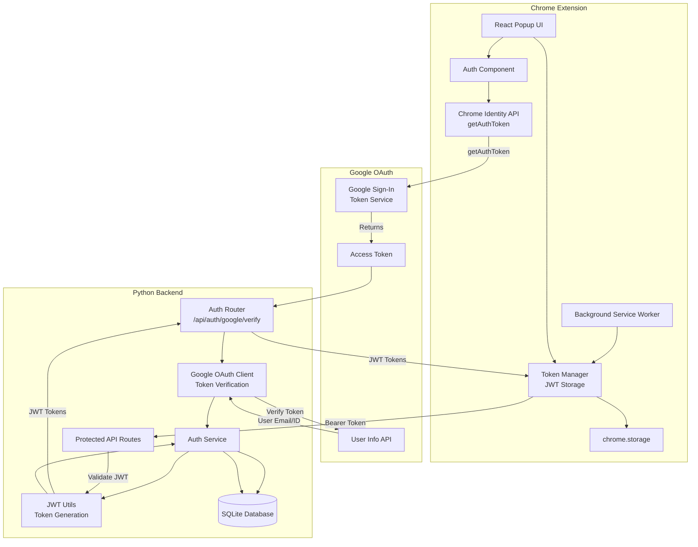
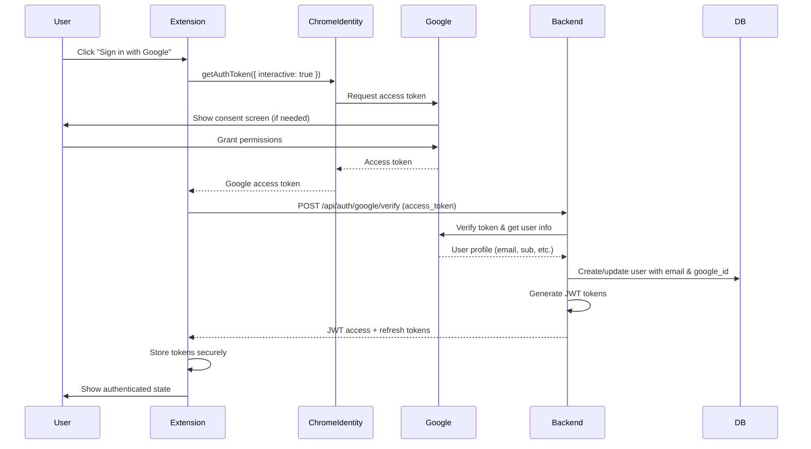
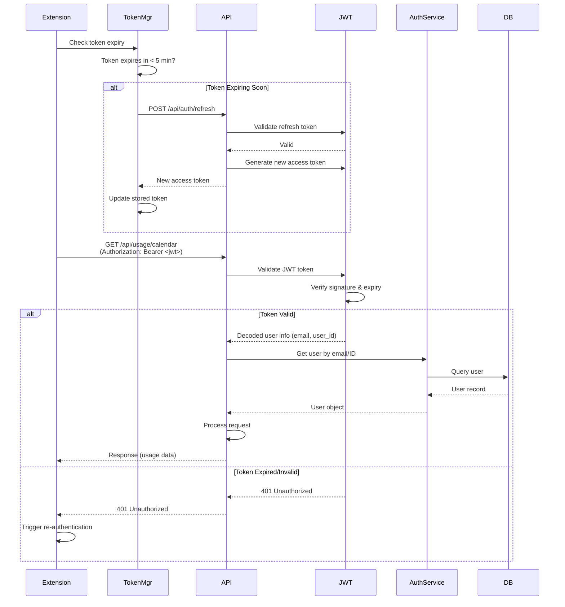
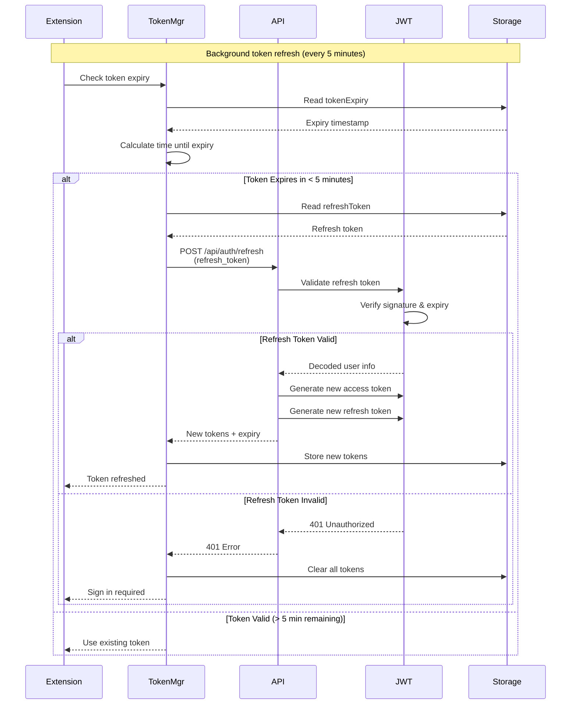
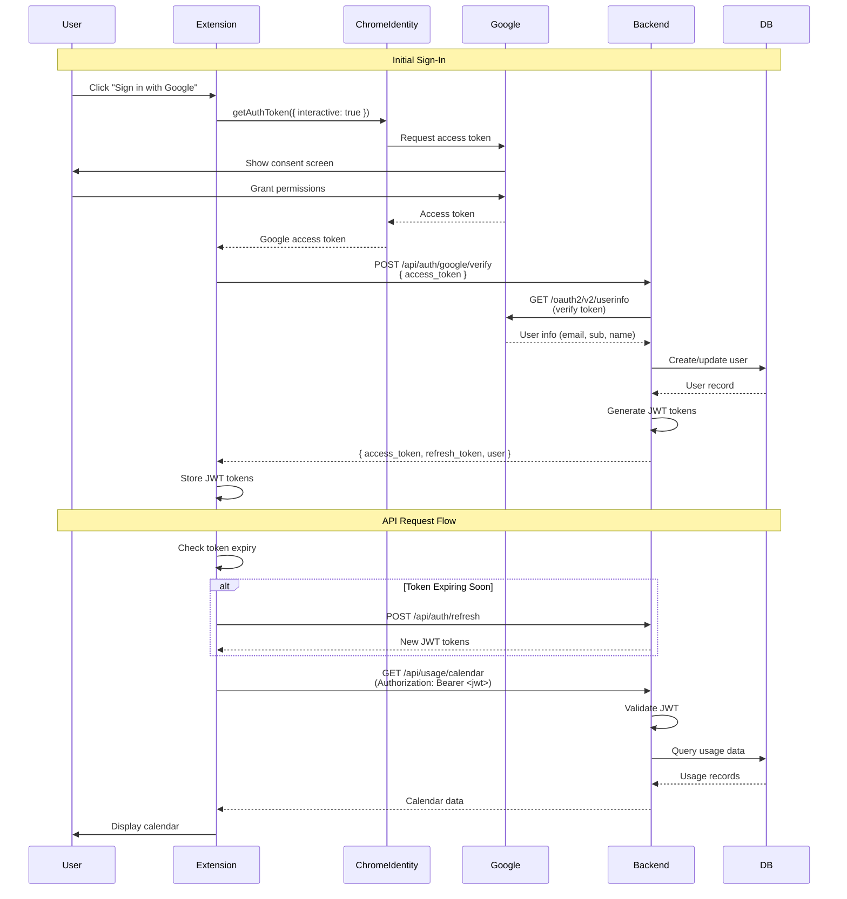

# OAuth2 Authentication Documentation

This document describes the OAuth2 authentication implementation for the Website Time Tracker Chrome Extension, including architecture, data flows, and development setup.

## Table of Contents

- [Overview](#overview)
- [Architecture](#architecture)
- [Authentication Flow](#authentication-flow)
- [Token Management](#token-management)
- [Development Mode](#development-mode)
- [Security Considerations](#security-considerations)
- [Troubleshooting](#troubleshooting)

## Overview

The application uses **OAuth2 with Google Sign-In** for user authentication. This replaces the previous `X-User-ID` header-based identification system with a secure, token-based authentication mechanism.

### Key Features

- **Google OAuth2**: Users authenticate using their Google accounts via `chrome.identity.getAuthToken()`
- **JWT Tokens**: Backend issues secure access and refresh tokens for API authentication
- **Automatic Token Refresh**: Tokens are automatically refreshed before expiry (every 5 minutes)
- **Chrome Identity API**: Native Chrome extension authentication flow (no redirect URI handling needed)
- **Token Verification**: Backend verifies Google access tokens and issues own JWTs
- **Development Mode**: Simplified authentication for local development with seeded test data

## Architecture

### System Architecture Diagram



### Component Descriptions

#### Extension Components

- **AuthUI**: React component for sign-in/sign-out UI
- **Token Manager**: Handles JWT token storage, retrieval, and automatic refresh
- **Chrome Identity API**: Uses `getAuthToken()` to obtain Google access tokens
- **Background Service Worker**: Handles token refresh in background (every 5 minutes)

#### Backend Components

- **Auth Router**: `/api/auth/google/verify` endpoint (verifies Google tokens, issues JWTs)
- **Auth Service**: Domain service for authentication logic and user management
- **JWT Utils**: JWT token generation, validation, and decoding
- **Google OAuth Client**: Verifies Google access tokens and fetches user info from Google APIs

## Authentication Flow

### Initial Sign-In Flow



### Authenticated API Request Flow



### Token Refresh Flow



## Complete Data Flow

### End-to-End Authentication and API Usage Flow



## Token Management

### Token Types

1. **Access Token (JWT)**
   - Short-lived (15 minutes)
   - Contains user email and ID
   - Used for API authentication
   - Stored in `chrome.storage.local`

2. **Refresh Token (JWT)**
   - Long-lived (30 days)
   - Used to obtain new access tokens
   - Stored securely in `chrome.storage.local`
   - Rotated on each refresh

3. **Google OAuth Tokens** (internal)
   - Used by backend to verify Google identity
   - Not stored in extension

### Token Storage Schema

```typescript
{
  accessToken: string,      // JWT access token
  refreshToken: string,     // JWT refresh token
  tokenExpiry: number,      // Timestamp when access token expires
  userEmail: string,        // User's email from Google
  userId: string,           // Backend user ID
}
```

### Automatic Token Refresh

The extension automatically refreshes tokens before they expire:

- **Check Interval**: Every 5 minutes (background alarm)
- **Refresh Threshold**: 5 minutes before expiry
- **Retry Logic**: Exponential backoff on failure
- **Background Refresh**: Service worker handles refresh even when popup is closed

## Development Mode

### Overview

In development mode (`ENVIRONMENT=dev`), test data is seeded with a specific test email address. To view this test data, you must sign in with a Google account using that email.

### Configuration

Set the following environment variables in `backend/.env`:

```bash
ENVIRONMENT=dev
DEV_TEST_EMAIL=writemileslee@gmail.com
```

### Test Data Setup

When running `./migrate.sh` with `ENVIRONMENT=dev`:

1. **Test User Created**: User with email `writemileslee@gmail.com`
2. **Test Data Seeded**: 
   - 3 tracked sites (youtube.com, reddit.com, twitter.com)
   - 7 days of usage history
   - Various usage patterns (over limit, under limit, at limit)

### Sign-In Process

1. **Start Backend**: Ensure `ENVIRONMENT=dev` is set
2. **Run Migration**: `./migrate.sh` (seeds test data)
3. **Load Extension**: Extension detects dev mode (localhost API)
4. **Sign In**: Click "Sign in with Google"
5. **Use Test Account**: Sign in with `writemileslee@gmail.com`
6. **View Data**: Test data is now visible in calendar and usage views

### Important Notes

- **Email Must Match**: The Google account email must match `DEV_TEST_EMAIL`
- **First Sign-In**: Creates user record if it doesn't exist
- **Subsequent Sign-Ins**: Maps to existing seeded user by email
- **Production Mode**: No test data is seeded, users authenticate normally

## Security Considerations

### Token Security

1. **Storage**: Tokens stored in `chrome.storage.local` (encrypted by Chrome)
2. **HTTPS Only**: OAuth redirects use HTTPS (enforced by Chrome Identity API)
3. **Short-Lived Access Tokens**: 15-minute expiry limits exposure window
4. **Token Rotation**: Refresh tokens are rotated on each use
5. **Secure JWT Secret**: Strong, randomly generated secret (min 32 characters)

### OAuth Security

1. **Redirect URI Validation**: Chrome Identity API validates redirect URIs
2. **State Parameter**: OAuth state parameter prevents CSRF attacks
3. **Token Verification**: Backend verifies Google tokens before issuing JWTs
4. **Email Verification**: Google verifies email addresses

### API Security

1. **Bearer Token Authentication**: All API requests use `Authorization: Bearer <token>`
2. **Token Validation**: Every request validates JWT signature and expiry
3. **User Isolation**: Users can only access their own data
4. **CORS Configuration**: Restricted to extension origin in production

## Troubleshooting

### Sign-In Issues

**Problem**: "Failed to sign in with Google"

**Solutions**:
- Check that `GOOGLE_CLIENT_ID` is set in backend `.env`
- Verify Chrome Identity API permission in `manifest.json`
- Check browser console for OAuth errors
- Ensure redirect URI matches Google Cloud Console configuration

**Problem**: "Invalid OAuth code"

**Solutions**:
- Verify `GOOGLE_CLIENT_SECRET` is correct
- Check that OAuth credentials match in Google Cloud Console
- Ensure redirect URI is properly configured

### Token Issues

**Problem**: "401 Unauthorized" errors

**Solutions**:
- Check if access token has expired (check `tokenExpiry` in storage)
- Verify token refresh is working (check background service worker logs)
- Clear storage and sign in again: `chrome.storage.local.clear()`
- Check that `JWT_SECRET` matches between token generation and validation

**Problem**: "Token refresh failed"

**Solutions**:
- Verify refresh token is still valid (30-day expiry)
- Check backend logs for refresh endpoint errors
- Sign out and sign in again to get new tokens
- Verify `JWT_SECRET` is correct

### Development Mode Issues

**Problem**: "No test data visible after sign-in"

**Solutions**:
- Verify `ENVIRONMENT=dev` is set in backend `.env`
- Check that migration was run: `./migrate.sh`
- Ensure you signed in with the email matching `DEV_TEST_EMAIL`
- Check database: `SELECT * FROM users WHERE email = 'writemileslee@gmail.com'`
- Verify user was created: Check backend logs during OAuth callback

**Problem**: "User not found" errors

**Solutions**:
- Run migration again to seed test data
- Verify email matches exactly (case-sensitive)
- Check that OAuth callback created user with correct email
- Verify database connection

### API Request Issues

**Problem**: "CORS errors"

**Solutions**:
- Verify backend CORS configuration allows extension origin
- Check that `allow_credentials=True` is set
- Ensure `Authorization` header is included in allowed headers

**Problem**: "Network errors"

**Solutions**:
- Verify backend is running on `http://localhost:8000`
- Check extension `API_BASE_URL` configuration
- Verify `host_permissions` in `manifest.json` includes API URL
- Check browser network tab for request details

## API Endpoints

### POST /api/auth/google/verify

Verify Google access token and issue JWT tokens.

**Request**:
```json
{
  "access_token": "google_access_token_from_chrome_identity"
}
```

**Response**:
```json
{
  "access_token": "jwt_access_token",
  "refresh_token": "jwt_refresh_token",
  "token_type": "bearer",
  "expires_in": 900,
  "user": {
    "id": "user_uuid",
    "email": "user@example.com"
  }
}
```

### POST /api/auth/refresh

Refresh access token using refresh token.

**Request**:
```json
{
  "refresh_token": "jwt_refresh_token"
}
```

**Response**:
```json
{
  "access_token": "new_jwt_access_token",
  "refresh_token": "new_jwt_refresh_token",
  "token_type": "bearer",
  "expires_in": 900
}
```

### Protected Endpoints

All existing API endpoints now require Bearer token authentication:

**Headers**:
```
Authorization: Bearer <access_token>
```

**Endpoints**:
- `GET /api/usage/calendar`
- `GET /api/usage/day`
- `POST /api/usage/sync`
- `GET /api/tracked-sites`
- `POST /api/tracked-sites/sync`

## Environment Variables

### Backend (.env)

```bash
# Google OAuth Configuration
GOOGLE_CLIENT_ID=your-google-client-id.apps.googleusercontent.com
GOOGLE_CLIENT_SECRET=your-google-client-secret

# JWT Configuration
JWT_SECRET=your-secret-key-min-32-chars
JWT_ALGORITHM=HS256
JWT_ACCESS_TOKEN_EXPIRE_MINUTES=15
JWT_REFRESH_TOKEN_EXPIRE_DAYS=30

# OAuth Redirect URI (for Chrome Extension)
OAUTH_REDIRECT_URI=https://your-extension-id.chromiumapp.org/

# Development Mode
ENVIRONMENT=dev
DEV_TEST_EMAIL=writemileslee@gmail.com
```

### Extension

No environment variables needed. Dev mode is automatically detected when `API_BASE_URL` contains `localhost` or `127.0.0.1`.

## Migration from X-User-ID

The system has been fully migrated from `X-User-ID` header authentication to OAuth2:

- **Removed**: `X-User-ID` header support
- **Replaced**: Bearer token authentication
- **Updated**: All API endpoints require valid JWT tokens
- **Migration**: Existing users must sign in with Google to continue using the extension

## Additional Resources

- [Google OAuth 2.0 Documentation](https://developers.google.com/identity/protocols/oauth2)
- [Chrome Identity API](https://developer.chrome.com/docs/extensions/reference/identity/)
- [JWT.io](https://jwt.io/) - JWT token decoder and validator
- [FastAPI Security](https://fastapi.tiangolo.com/tutorial/security/) - FastAPI authentication patterns
